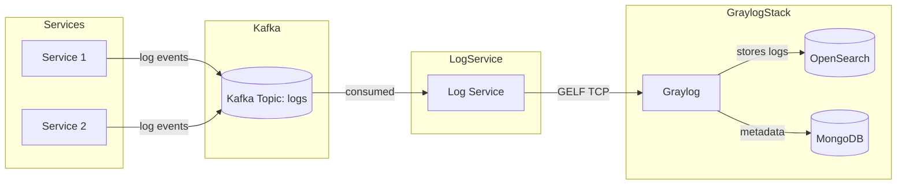
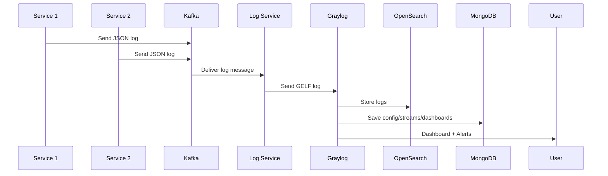

# Log Management System

## Description

The **Log Management System** is a production-ready, centralized logging platform designed to simplify log collection, aggregation, monitoring, and alerting across distributed microservices. Built with **Spring Boot 3.5.3**, **Apache Kafka**, and **Graylog 6.3**, this system provides a comprehensive solution for structured log ingestion, real-time processing, visualization, and automated alerting.

This project demonstrates enterprise-grade logging architecture patterns, featuring:
- **Asynchronous log processing** through Kafka messaging
- **Automatic Graylog configuration** with streams, dashboards, and alerts
- **GELF (Graylog Extended Log Format)** integration for structured logging
- **MDC (Mapped Diagnostic Context)** enrichment for contextual log data
- **Docker-based deployment** for easy environment setup and scaling

The system reduces operational overhead by automating the complete logging infrastructure setup, enabling developers to focus on application logic while maintaining comprehensive observability.

## Features

### Core Functionality
* **Centralized log collection** from multiple Spring Boot microservices (Java 21)
* **Kafka-based message transport** for reliable, asynchronous log delivery
* **Dedicated log-service** consuming Kafka messages and forwarding to Graylog via GELF TCP
* **Structured logging** with JSON format and MDC context enrichment
* **Multi-level log support** (DEBUG, INFO, WARN, ERROR) with proper routing

### Automated Graylog Setup
* **GELF TCP input** creation on port 12201
* **Service-specific streams** with automatic routing rules
* **Pre-configured dashboards** for each service including:
  - Log count widgets
  - Error rate monitoring  
  - Response time tracking
  - Log source analysis
* **Event-driven alerts** for ERROR level logs
* **Comprehensive search queries** for log analysis

### Infrastructure & Deployment
* **Docker Compose** orchestration for complete environment
* **Multi-service architecture** with service1, service2, and log-service
* **OpenSearch 2.x** as Graylog's storage backend
* **MongoDB 6.0.5** for Graylog metadata storage
* **Automatic initialization** via `graylog-init.sh` script

### Developer Experience
* **REST endpoints** (`/log`) for testing log generation
* **Health checks** and monitoring capabilities
* **Configurable log levels** via request parameters
* **Real-time log visualization** in Graylog web interface

Here are two schemas you can include in your README to better illustrate the project setup:

---

## 🏗️ System Architecture



---

## 📊 Log Flow



## Installation

### Prerequisites

* **Docker** & **Docker Compose** (v2.0+)
* **Java 21** (for local development)
* **Maven 3.6+** (for building from source)
* **jq** CLI tool (for Graylog initialization script)
* **curl** (for testing REST endpoints)

### Quick Start

1. **Clone the repository:**
   ```bash
   git clone https://github.com/idris-saddi/log-management.git
   cd log-management
   ```

2. **Start the complete environment:**
   ```bash
   docker compose up -d --build
   ```

3. **Verify services are running:**
   ```bash
   docker compose ps
   ```

4. **Wait for Graylog initialization:**
   - Graylog UI: [http://localhost:9000](http://localhost:9000)
   - Username: `admin`, Password: `admin`
   - The `graylog-init` container will automatically configure streams, dashboards, and alerts

5. **Test log generation:**
   ```bash
   # Service 1 - INFO log
   curl -X POST "http://localhost:8081/log?message=ApplicationStarted&level=INFO"
   
   # Service 2 - ERROR log  
   curl -X POST "http://localhost:8082/log?message=DatabaseConnectionFailed&level=ERROR"
   ```

### Port Configuration

| Service | Port | Description |
|---------|------|-------------|
| Graylog Web UI | 9000 | Web interface for log management |
| OpenSearch | 9200 | Search engine backend |
| Service 1 | 8081 | Microservice with logging endpoints |
| Service 2 | 8082 | Microservice with logging endpoints |
| Log Service | 8083 | Kafka consumer and GELF forwarder |
| Kafka | 9092 | Message broker |
| Zookeeper | 2181 | Kafka coordination |
| GELF TCP | 12201 | Graylog log input |

## Usage

### Testing Log Generation

Each service exposes REST endpoints for generating test logs with different severity levels:

**Service 1 Examples:**
```bash
# INFO level log
curl -X POST "http://localhost:8081/log?message=UserAuthenticated&level=INFO"

# ERROR level log (triggers alerts)
curl -X POST "http://localhost:8081/log?message=PaymentProcessingFailed&level=ERROR"

# WARNING level log
curl -X POST "http://localhost:8081/log?message=SlowDatabaseQuery&level=WARN"

# GET request (also supported)
curl "http://localhost:8081/log?message=HealthCheckPassed&level=INFO"
```

**Service 2 Examples:**
```bash
# ERROR with detailed message
curl -X POST "http://localhost:8082/log?message=OutOfMemoryError&level=ERROR"

# DEBUG level log
curl -X POST "http://localhost:8082/log?message=CacheHitRatio95Percent&level=DEBUG"
```

### Log Flow Architecture

1. **Service generates log** → JSON message created with timestamp, level, service name
2. **Kafka transport** → Message sent to `logs` topic 
3. **Log-service consumption** → Kafka consumer processes message
4. **MDC enrichment** → Additional context fields added (service, level, originalTS)
5. **GELF forwarding** → Structured log sent to Graylog via TCP port 12201
6. **Graylog processing** → Automatic routing to service-specific streams

### Graylog Interface

**Accessing Dashboards:**
1. Open [http://localhost:9000](http://localhost:9000)
2. Login with `admin`/`admin`
3. Navigate to **Dashboards** → Select service-specific dashboard
4. View real-time metrics: log counts, error rates, response times

**Viewing Logs:**
1. Go to **Streams** → Select service stream (e.g., "service1 Stream")
2. Use **Search** page for advanced log queries
3. Apply filters by time range, log level, or custom fields

**Monitoring Alerts:**
1. Check **Alerts & Events** for ERROR level notifications
2. Review **Event Definitions** for configured alert rules
3. Alerts automatically trigger for any ERROR level logs

### Advanced Search Examples

```bash
# Search for all ERROR logs from service1
service:service1 AND level:ERROR

# Find logs in last 5 minutes
service:service2 AND timestamp:[now-5m TO now]

# Search by specific message content
message:*Authentication* AND level:INFO
```

## Technologies Used

### Backend & Framework
* **Java 21** - Latest LTS version with modern language features
* **Spring Boot 3.5.3** - Enterprise application framework
* **Spring Kafka** - Kafka integration for Spring Boot
* **Maven** - Dependency management and build tool

### Messaging & Storage
* **Apache Kafka** (wurstmeister/kafka) - Distributed message streaming
* **Apache Zookeeper** (confluentinc/cp-zookeeper:7.4.3) - Kafka coordination
* **OpenSearch 2.x** - Search and analytics engine (Graylog storage)
* **MongoDB 6.0.5** - Document database (Graylog metadata)

### Logging Stack
* **Graylog 6.3** - Centralized log management platform
* **GELF (Graylog Extended Log Format)** - Structured log transport
* **Logback** - Logging framework with GELF appender
* **SLF4J MDC** - Mapped Diagnostic Context for log enrichment

### Infrastructure & Tools
* **Docker & Docker Compose** - Containerization and orchestration
* **logback-gelf** - GELF TCP appender for Logback
* **Jackson** - JSON processing library
* **jq** - Command-line JSON processor (for init scripts)

### Development & Build
* **Maven Wrapper** - Consistent build environment
* **Spring Boot DevTools** - Development-time features
* **JUnit 5** - Testing framework

## Configuration

### Environment Variables

| Variable | Default | Description |
|----------|---------|-------------|
| `GRAYLOG_HOST` | `graylog` | Hostname for GELF TCP connection |
| `GRAYLOG_PORT` | `12201` | Port for GELF TCP input |
| `GRAYLOG_PASSWORD_SECRET` | `somepasswordpepper` | Graylog encryption key |
| `GRAYLOG_ROOT_PASSWORD_SHA2` | `8c6976e5b...` | SHA2 hash of admin password |

### Service Configuration Files

**Logback Configuration (`logback-spring.xml`):**
```xml
<appender name="GELF-TCP" class="de.siegmar.logbackgelf.GelfTcpAppender">
    <graylogHost>graylog</graylogHost>
    <port>12201</port>
    <encoder class="de.siegmar.logbackgelf.GelfEncoder">
        <facility>service-name</facility>
        <includeMdcData>true</includeMdcData>
    </encoder>
</appender>
```

**Kafka Configuration (`application.properties`):**
```properties
# Kafka Producers (service1, service2)
spring.kafka.bootstrap-servers=kafka:9092
spring.kafka.producer.key-serializer=org.apache.kafka.common.serialization.StringSerializer
spring.kafka.producer.value-serializer=org.apache.kafka.common.serialization.StringSerializer

# Kafka Consumer (log-service)
spring.kafka.consumer.group-id=log-consumers
spring.kafka.consumer.auto-offset-reset=earliest
```

### Graylog Initialization

The `graylog-init.sh` script automatically configures:
- **GELF TCP Input** on port 12201
- **Service Streams** with routing rules
- **Dashboards** with visualization widgets
- **Alert Rules** for ERROR level logs

**Customization Options:**
- Modify `SERVICES="service1 service2"` to add/remove services
- Adjust dashboard widgets in the script
- Configure additional alert conditions
- Set custom stream routing rules

### Docker Compose Customization

**Volume Mounts:**
```yaml
volumes:
  - mongo_data:/data/db           # MongoDB persistence
  - log_data:/usr/share/opensearch/data  # OpenSearch data
  - graylog_data:/usr/share/graylog/data # Graylog configuration
```

**Network Configuration:**
```yaml
networks:
  graynet:
    driver: bridge  # Internal service communication
```

## Project Structure

```
log-management/
├── docker-compose.yml              # Complete environment orchestration
├── graylog-init.Dockerfile        # Custom init container
├── graylog-init.sh                 # Automated Graylog configuration script
├── config/
│   ├── graylog.conf               # Graylog server configuration
│   └── nxlog.conf                 # NXLog configuration (if needed)
├── log-service/                   # Kafka consumer + GELF forwarder
│   ├── src/main/java/com/idris/log_service/
│   │   ├── LogServiceApplication.java
│   │   ├── kafka/LogConsumer.java
│   │   ├── service/LogProcessorService.java
│   │   ├── dto/LogMessage.java
│   │   └── config/KafkaConfig.java
│   ├── src/main/resources/
│   │   ├── application.properties
│   │   └── logback-spring.xml     # GELF TCP appender configuration
│   └── pom.xml                    # Spring Boot + Kafka + GELF dependencies
├── service1/                      # Example microservice
│   ├── src/main/java/com/idris/service1/
│   │   ├── Service1Application.java
│   │   └── LogController.java     # REST endpoints for log testing
│   ├── src/main/resources/
│   │   ├── application.properties
│   │   └── logback-spring.xml
│   └── pom.xml
├── service2/                      # Another example microservice
│   └── [similar structure to service1]
└── README.md                      # This documentation
```

### Key Components

**Log Service (`log-service/`):**
- Consumes JSON logs from Kafka `logs` topic
- Enriches logs with MDC context (service, level, timestamp)
- Forwards structured logs to Graylog via GELF TCP

**Example Services (`service1/`, `service2/`):**
- Spring Boot applications with REST endpoints
- Generate logs and send them to Kafka
- Demonstrate different log levels and message types

**Initialization (`graylog-init.sh`):**
- Waits for Graylog API availability
- Creates GELF TCP input automatically
- Sets up streams, dashboards, and alerts for each service
- Configures comprehensive monitoring widgets

## Troubleshooting

### Common Issues

**1. Graylog Init Container Fails**
```bash
# Check init container logs
docker logs graylog-init

# Verify Graylog is accessible
curl -u admin:admin http://localhost:9000/api/system/inputs
```

**2. Services Can't Connect to Kafka**
```bash
# Check Kafka status
docker logs kafka

# Verify Kafka topic exists
docker exec -it kafka kafka-topics.sh --bootstrap-server localhost:9092 --list
```

**3. No Logs Appearing in Graylog**
```bash
# Check log-service logs
docker logs log-service

# Verify GELF TCP input is created
# Go to System/Inputs in Graylog UI

# Test GELF connection manually
echo '{"version":"1.1","host":"test","short_message":"test"}' | nc localhost 12201
```

**4. Permission Issues (macOS/Linux)**
```bash
# Fix Docker volume permissions
sudo chown -R $(whoami):$(whoami) ./data
```

### Health Checks

**Service Health:**
```bash
# Check all container status
docker compose ps

# Service-specific health
curl http://localhost:8081/actuator/health  # service1
curl http://localhost:8082/actuator/health  # service2
```

**Log Flow Verification:**
```bash
# Generate test log
curl -X POST "http://localhost:8081/log?message=TestMessage&level=INFO"

# Check Kafka topic
docker exec -it kafka kafka-console-consumer.sh \
  --bootstrap-server localhost:9092 \
  --topic logs --from-beginning
```

### Performance Tuning

**Memory Allocation:**
- OpenSearch: Default 1GB heap (`OPENSEARCH_JAVA_OPTS=-Xms1g -Xmx1g`)
- Graylog: Increase if processing high log volumes
- Kafka: Adjust `server.properties` for high throughput

**Log Retention:**
- Configure OpenSearch index retention policies
- Set Graylog stream processing rules
- Monitor disk usage with high log volumes

## Contributing

### Development Setup

1. **Fork and clone the repository:**
   ```bash
   git clone https://github.com/idris-saddi/log-management.git
   cd log-management
   ```

2. **Local development (without Docker):**
   ```bash
   # Start only infrastructure
   docker compose up -d mongo opensearch zookeeper kafka graylog
   
   # Run services locally
   cd log-service && mvn spring-boot:run
   cd service1 && mvn spring-boot:run
   cd service2 && mvn spring-boot:run
   ```

3. **Testing changes:**
   ```bash
   # Run tests
   mvn test
   
   # Build images
   docker compose build
   ```

### Contribution Guidelines

- Follow **Java Code Conventions** and Spring Boot best practices
- Add **unit tests** for new functionality
- Update **README.md** for configuration changes
- Test **Docker Compose** setup before submitting
- Include **meaningful commit messages**

### Suggested Improvements

- [ ] Add Prometheus metrics integration
- [ ] Implement log retention policies
- [ ] Add authentication for service endpoints
- [ ] Create Kubernetes deployment manifests
- [ ] Add distributed tracing with Zipkin/Jaeger
- [ ] Implement log sampling for high-volume scenarios

## License

This project is licensed under the **MIT License**. See the [LICENSE](LICENSE) file for details.

---

## Contact / Questions

For support, questions, or collaboration:

* **Email:** [saddi.idris@gmail.com](mailto:saddi.idris@gmail.com)
* **GitHub:** [idris-saddi](https://github.com/idris-saddi)
* **Issues:** [GitHub Issues](https://github.com/idris-saddi/log-management/issues)

### Professional Services

Available for consulting on:
- Enterprise logging architecture design
- Distributed systems observability
- Spring Boot microservices development
- DevOps and containerization strategies

---

*Built with ❤️ by [Idris SADDI](https://github.com/idris-saddi)*
