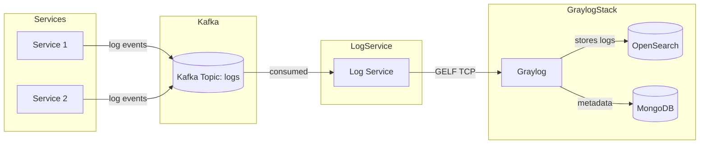
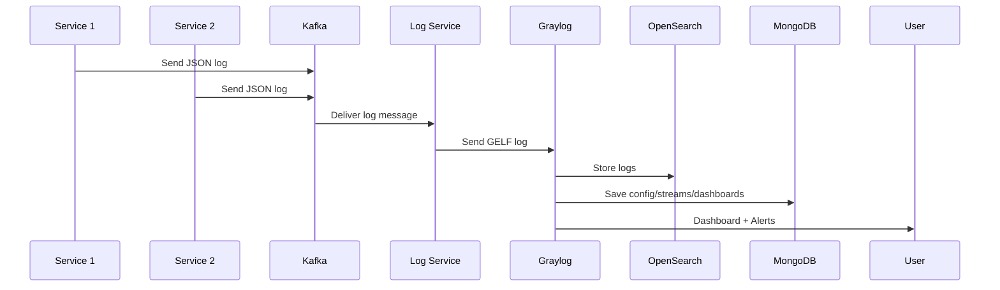

# Log Management System

## Description

The **Log Management System** is a centralized logging platform built to simplify and automate log collection, aggregation, monitoring, and alerting across distributed microservices. It leverages **Spring Boot microservices, Kafka, and Graylog** to provide a robust solution for structured log ingestion, forwarding, visualization, and alerting.

This project was designed to help developers and operators monitor distributed systems efficiently. Logs from multiple services are pushed into **Kafka**, consumed by a dedicated **log-service**, and then forwarded into **Graylog** for structured visualization, dashboarding, and alerting.

By automating Graylog setup with dashboards, widgets, and alert rules for each service, the system reduces manual effort, improves observability, and provides real-time insights into application behavior.

## Features

* Centralized log collection from multiple Spring Boot microservices.
* Kafka-based transport layer for reliable log ingestion.
* Dedicated **log-service** to consume logs and forward them to Graylog.
* Automated **Graylog initialization script** (`graylog-init.sh`) that:

  * Creates GELF TCP input.
  * Sets up streams and routing rules per service.
  * Generates dashboards with widgets (log counts, error rates, response times, sources).
  * Defines event-based alerts for error detection.
* Structured logging with MDC context fields (`service`, `level`, `timestamp`).
* Docker Compose setup for full environment: Graylog, MongoDB, OpenSearch, Zookeeper, Kafka, and services.

Here are two schemas you can include in your README to better illustrate the project setup:

---

## 🏗️ System Architecture



---

## 📊 Log Flow



## Installation

### Prerequisites

* Docker & Docker Compose installed
* Java 21
* Maven or Gradle
* `jq` CLI installed (for the initialization script)

### Steps

1. Clone the repository:

   ```bash
   git clone https://github.com/your-username/log-management.git
   cd log-management
   ```
2. Start the environment with Docker Compose:

   ```bash
   docker-compose up -d --build
   ```
3. Wait for Graylog to become available at [http://localhost:9000](http://localhost:9000)

   * Username: `admin`
   * Password: `admin`
4. The `graylog-init` service will automatically run `graylog-init.sh` to configure streams, dashboards, and alerts.

## Usage

### Sending Logs from a Service

Services expose REST endpoints (`/log`) to generate test logs.

Example (Service 1):

```bash
curl -X POST "http://localhost:8081/log?message=HelloWorld&level=INFO"
```

Example (Service 2):

```bash
curl "http://localhost:8082/log?message=SomethingWentWrong&level=ERROR"
```

The log is serialized into JSON, sent to Kafka (`logs` topic), consumed by `log-service`, enriched with MDC fields, and forwarded to Graylog.

### Viewing Logs in Graylog

1. Open [http://localhost:9000](http://localhost:9000)
2. Navigate to **Streams** → select a service stream.
3. Explore **Dashboards** automatically created for each service.

### Alerts

Graylog event definitions automatically trigger alerts for `ERROR` logs. Alerts appear in the Graylog UI under **Alerts**.

## Technologies Used

* **Java 21**
* **Spring Boot 3.5.3**
* **Apache Kafka** + Zookeeper
* **Graylog 6.3**
* **OpenSearch 2.x** (as Graylog storage)
* **MongoDB 6.0.5** (as Graylog metadata store)
* **Docker & Docker Compose**
* **Logback + GELF Appender** for structured logging
* **jq** for JSON manipulation in the init script

## Configuration

* `docker-compose.yml` orchestrates all services.
* Environment variables:

  * `GRAYLOG_HOST` (default: `graylog`)
  * `GRAYLOG_PORT` (default: `12201`)
* Logging configuration (`logback-spring.xml`) can be adjusted per service.
* `graylog-init.sh` automates Graylog setup (can be modified to add/remove widgets or alerts).

## Contributing

Contributions are welcome! Please follow these steps:

1. Fork the repository
2. Create a new branch: `git checkout -b feature/your-feature`
3. Commit changes: `git commit -m 'Add your feature'`
4. Push to the branch: `git push origin feature/your-feature`
5. Open a Pull Request

You can also report issues or suggest features via the GitHub **Issues** tab.

## License

This project is licensed under the **MIT License**. See the [LICENSE](LICENSE) file for details.

## Contact / Questions

For support or questions:

* Email: **[saddi.idris@gmail.com](mailto:saddi.idris@gmail.com)**
* GitHub: [idris-saddi](https://github.com/idris-saddi)
