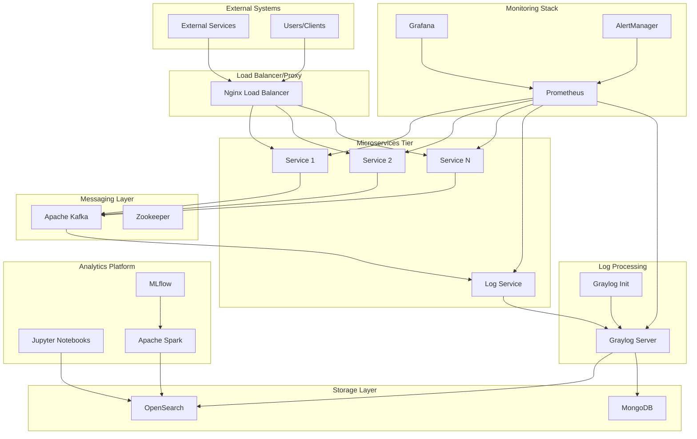

# Log Management System - Architecture Documentation

## System Overview

The Log Management System is a comprehensive, enterprise-grade logging platform designed for microservices environments. It provides centralized log collection, processing, storage, and analysis capabilities.

## Architecture Diagram

## Component Details

### 1. Microservices Layer
- **Service 1 & 2**: Example business services with REST APIs
- **Log Service**: Kafka consumer that forwards logs to Graylog via GELF

### 2. Messaging Infrastructure
- **Apache Kafka**: Asynchronous message broker for log events
- **Zookeeper**: Kafka cluster coordination

### 3. Log Processing Engine
- **Graylog**: Central log management server
- **Graylog Init**: Automated configuration service

### 4. Storage Systems
- **OpenSearch**: Primary log storage and search engine
- **MongoDB**: Graylog metadata and configuration storage

### 5. Monitoring & Observability
- **Prometheus**: Metrics collection and storage
- **Grafana**: Metrics visualization and dashboards
- **AlertManager**: Alert routing and notification

### 6. Analytics Platform
- **Jupyter**: Interactive log analysis notebooks
- **Apache Spark**: Big data processing for log analytics
- **MLflow**: Machine learning model management

## Data Flow

1. **Log Generation**: Services generate logs using structured logging
2. **Message Publishing**: Logs sent to Kafka topics asynchronously
3. **Log Consumption**: Log service consumes from Kafka
4. **GELF Forwarding**: Logs forwarded to Graylog via GELF TCP
5. **Processing**: Graylog processes and enriches log data
6. **Storage**: Processed logs stored in OpenSearch
7. **Visualization**: Logs visualized in Graylog dashboards
8. **Alerting**: Critical events trigger alerts
9. **Analytics**: Historical data analyzed in Jupyter/Spark

## Security Architecture

- **Network Segmentation**: Isolated networks for different tiers
- **TLS Encryption**: All external communication encrypted
- **Authentication**: JWT-based service authentication
- **Authorization**: Role-based access control
- **Secrets Management**: HashiCorp Vault integration

## Scalability Considerations

- **Horizontal Scaling**: All services designed for horizontal scaling
- **Load Balancing**: Nginx for request distribution
- **Kafka Partitioning**: Log distribution across partitions
- **OpenSearch Clustering**: Multi-node search cluster support
- **Auto-scaling**: Kubernetes HPA support

## High Availability

- **Service Redundancy**: Multiple instances per service
- **Data Replication**: OpenSearch and MongoDB replication
- **Health Checks**: Comprehensive health monitoring
- **Circuit Breakers**: Fault tolerance patterns
- **Backup Strategies**: Automated backup and restore
